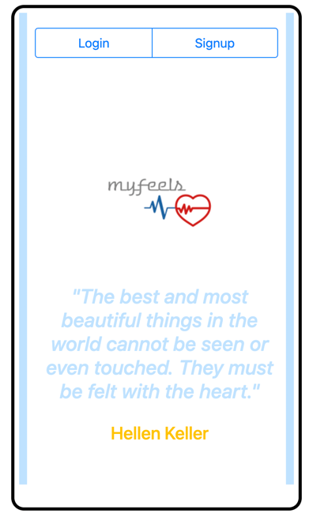
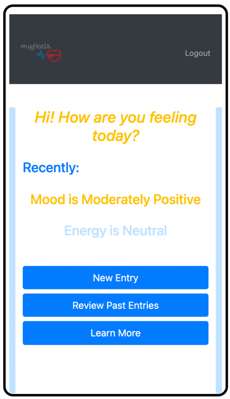
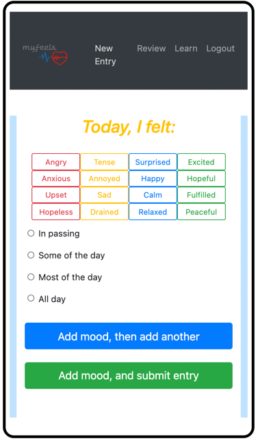
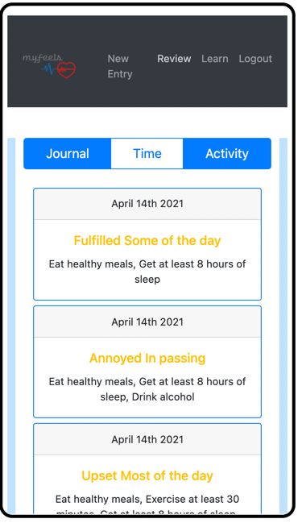
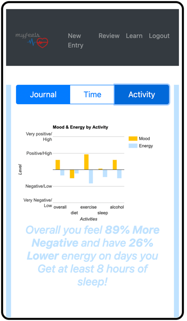
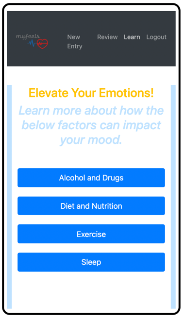

**myFeels** 

myFeels is an easy-to-use feelings/mood tracker.
With myFeels, you can identify factors affecting moods throughout days/weeks/months and visualise this trend with data visualization. As an added bonus, you are also able to learn how these factors then affect your mood to encourage actionable changes in lifestyle in users to better their mood.
To use this app, first sign up for an account and start adding your mood along with how often you've felt this way. Multiple entries per day are allowed. Additionally, do input if you've engaged in the 4 pillars affecting mood which is 1. Eating Healthy Meals, 2. Getting at least 8 Hours of Sleep, 3. Exercising for at least 30 minutes and 3. Intaking Alcohol.

Technologies Used:

1. React
2. Node.js
3. Express
4. Mongoose

Npm/Yarn Install:

1. Axios
2. Bootstrap
3. Moment
4. React
5. React-bootstrap
6. React-dom
7. React-google-charts
8. React-hook-form
9. React-router-dom
10. React-scripts 
11. Dotenv
12. Express
13. if-env
14. Mongoose

